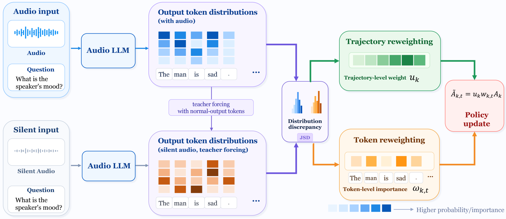

# AD²PO: Audio-Dependency-Driven Policy Optimization

Official research code for **Credit Where Audio Matters: Audio-Dependent Credit
Assignment for Audio Reasoning**. This repository extends
[Ke-Omni-R](https://github.com/shuaijiang/Ke-Omni-R) with AD²PO, a GRPO variant
that assigns learning credit according to how strongly each generated token
depends on the audio.

AD²PO compares the policy's next-token distribution under the original audio
and a duration-matched silent counterfactual. Full-vocabulary Jensen–Shannon
divergence (JSD) provides a bounded dependency score. Detached scores reweight
the task-derived GRPO advantage across sampled trajectories and across tokens;
they are **not** optimized as an auxiliary reward.

[](figures/ad2po_framework.pdf)

Click the figure to open the vector PDF.

## Results

Multiple-choice accuracy (%) with Qwen2.5-Omni-7B:

| Method | MMAU Speech | Sound | Music | MMAU Avg. | MMAR Avg. | ADQA-Bench |
|---|---:|---:|---:|---:|---:|---:|
| Qwen2.5-Omni-7B¹ | 72.97 | 79.28 | **67.96** | 73.40 | 59.70 | 45.90 |
| GRPO | 76.58 | 81.38 | 66.77 | 74.90 | 61.70 | 54.07 |
| **AD²PO** | **76.88** | **83.48** | **67.96** | **76.10** | **63.00** | **55.13** |
| └ w/o token weighting | 73.87 | 81.98 | 66.17 | 74.00 | 62.60 | 53.63 |
| └ w/o trajectory weighting | 74.17 | 82.28 | 67.66 | 74.70 | 62.70 | – |

¹ The base model uses a direct-answer prompt. All RL models use the same
reasoning prompt and greedy evaluation protocol.

## Method

For sampled response `k` and token position `t`, let `p[k,t]` and `q[k,t]` be
the current policy distributions obtained by teacher forcing the same response
under the real and silent audio. We compute

```text
d[k,t] = JSD(p[k,t], q[k,t])
D[k]   = mean_t d[k,t]
```

Trajectory scores are min–max normalized within the `K=8` rollouts for one
question, then centered and shifted:

```text
z[k] = minmax_k(D[k])
u[k] = 1 + z[k] - mean_k(z[k])
```

Token scores receive the same operation within each response:

```text
v[k,t] = minmax_t(d[k,t])
w[k,t] = 1 + v[k,t] - mean_t(v[k,t])
```

The GRPO advantage becomes `A_tilde[k,t] = stopgrad(u[k] * w[k,t]) * A[k]`.
Both sets of weights have mean one, stay in `[0, 2]`, preserve the sign of the
task advantage, and preserve total credit at their respective scale. Constant
score groups fall back to uniform weights.

## Installation

Python 3.10+ and recent CUDA GPUs are required. The reported full-parameter
experiments use two high-memory GPUs and DeepSpeed ZeRO-3 without CPU offload.

```bash
git clone https://github.com/shuaijiang/Ke-Omni-R.git
cd Ke-Omni-R
python -m venv .venv
source .venv/bin/activate
pip install --upgrade pip
pip install -r requirements.txt
```

`ffmpeg` is additionally required when preparing AVQA audio.

## Data preparation

Training expects JSONL rows with this schema:

```json
{
  "id": "example_id",
  "audio_path": "/absolute/path/to/audio.wav",
  "question_text": "Which event is audible?",
  "multi_choice": ["A", "B", "C", "D"],
  "answer": 1,
  "dataset_name": "AVQA"
}
```

The paper uses a fixed mixture of 5,400 examples: 1,800 each from AVQA,
MusicBench, and MMSU. First prepare each source using the included scripts:

```bash
# AVQA: downloads eligible source videos and extracts 16-kHz mono WAV files
python scripts/prepare_avqa.py \
  --annotations /path/to/avqa/train_qa.json \
  --audio-dir /data/avqa/audio \
  --output /data/prepared/avqa.jsonl \
  --count 5000 --seed 42

# MusicBench: metadata and audio are obtained from the upstream dataset
python scripts/prepare_musicbench.py \
  --metadata /path/to/musicbench.jsonl \
  --audio-root /data/musicbench/audio \
  --output /data/prepared/musicbench.jsonl \
  --count 5000 --seed 42

# MMSU: extract audio embedded in downloaded Hugging Face parquet shards
python scripts/prepare_mmsu.py \
  --parquet-dir /data/mmsu/parquet \
  --audio-dir /data/mmsu/audio \
  --metadata-file /data/prepared/mmsu.json
```

Create the deterministic balanced mixture:

```bash
python scripts/build_avqa_musicbench_mmsu_5400.py \
  --avqa /data/prepared/avqa.jsonl \
  --musicbench /data/prepared/musicbench.jsonl \
  --mmsu /data/prepared/mmsu.json \
  --output data/train.jsonl \
  --count 1800 --seed 42
```

The builder prints a SHA-256 digest. Keep it with experiment logs to verify
that baseline and AD²PO runs use identical examples and ordering.

## Training

The default command reproduces the paper's joint trajectory-and-token method:

```bash
MODEL_PATH=Qwen/Qwen2.5-Omni-7B \
DATA_FILE=/data/train.jsonl \
OUTPUT_DIR=/data/outputs/ad2po \
NUM_GPUS=2 \
METHOD=joint \
bash train_omni_grpo.sh
```

The four controlled variants are:

| `METHOD` | Trajectory weights | Token weights |
|---|:---:|:---:|
| `grpo` | – | – |
| `trajectory` | ✓ | – |
| `token` | – | ✓ |
| `joint` | ✓ | ✓ |

Defaults match the paper: 8 rollouts, per-device batch size 1, gradient
accumulation 8, 338 optimizer updates, constant learning rate `1e-6`, reference
KL coefficient `0.01`, accuracy/format reward weights `2:1`, temperature `1.0`,
128 generated tokens, frozen audio
encoder, and seed 42. With two GPUs the global prompt batch is 16. Override any
setting through the environment variables shown in `train_omni_grpo.sh`.

SwanLab logging is enabled by default. Set `REPORT_TO=none` for offline runs or
set `SWANLAB_PROJECT_NAME`, `SWANLAB_MODE`, and `SWANLAB_LOG_DIR` as needed.

## Evaluation

### MMAU Test-mini

Use the official MMAU annotations and evaluation script. If audio comes from
parquet mirrors, `prepare_mmau_test_mini.py` verifies every mirrored row against
the official metadata before writing local paths.

```bash
python scripts/prepare_mmau_test_mini.py \
  --official-json /data/MMAU/mmau-test-mini.json \
  --parquet-dir /data/MMAU/parquet \
  --audio-dir /data/MMAU/audio \
  --output data/MMAU/mmau-test-mini.local.json

MODEL_PATH=/data/outputs/ad2po \
DATA_FILE=data/MMAU/mmau-test-mini.local.json \
MMAU_ROOT=/data/MMAU \
OUTPUT_DIR=/data/eval/mmau-ad2po \
bash evaluate_mmau.sh
```

Set `THINK=false` only for the untrained base-model reference. Trained models
must use `THINK=true` so evaluation matches the training prompt.

### MMAR

```bash
PYTHONPATH=src python scripts/eval_mmar.py \
  --model-path /data/outputs/ad2po \
  --data-file /data/MMAR/MMAR-meta.json \
  --audio-root /data/MMAR/audio \
  --out-file /data/eval/mmar-ad2po.jsonl \
  --batch-size 8 --max-new-tokens 128 --think --think-max-len 128

python scripts/prepare_mmar_scoring.py \
  --input /data/eval/mmar-ad2po.jsonl \
  --output /data/eval/mmar-ad2po.scoring.json
python /data/MMAR/code/evaluation.py \
  --input /data/eval/mmar-ad2po.scoring.json
```

### ADQA-Bench

```bash
PYTHONPATH=src python scripts/eval_adqa.py \
  --model-path /data/outputs/ad2po \
  --data-file /data/ADQA-Bench/eval.jsonl \
  --data-root /data/ADQA-Bench \
  --out-file /data/eval/adqa-ad2po.jsonl \
  --batch-size 8 --max-new-tokens 256 --think --think-max-len 128

```

Evaluation writers are resumable. Generated content is stopped after
`</answer>`, and prompts explicitly prohibit trailing text.

## Repository structure

```text
conf/zero3.json                         GPU-only ZeRO-3 configuration
figures/ad2po_framework.pdf             paper framework figure
figures/ad2po_framework.png             README preview
src/train.py                            training entry point
src/trainer/grpo_trainer.py             GRPO and AD²PO implementation
src/dataset/dataset.py                  prompt/data adapter
src/test.py                             MMAU inference
scripts/prepare_*.py                    dataset preparation
scripts/build_avqa_musicbench_mmsu_5400.py
scripts/eval_*.py                       MMAR/ADQA inference
train_omni_grpo.sh                      reproducible distributed launcher
evaluate_mmau.sh                        MMAU launcher
```

Large datasets, base models, checkpoints, and logs are intentionally excluded
from Git. Store them on a dedicated data volume and pass absolute paths through
the launchers.

## Acknowledgements

This code builds on [Ke-Omni-R](https://github.com/shuaijiang/Ke-Omni-R),
[TRL](https://github.com/huggingface/trl),
[Qwen2.5-Omni](https://github.com/QwenLM/Qwen2.5-Omni), and
[R1-AQA](https://github.com/xiaomi-research/r1-aqa). We thank the authors of
AVQA, MusicBench, MMSU, MMAU, MMAR, and ADQA-Bench.

## Citation

The manuscript is currently under review and has not been posted as a public
preprint. Until a public paper record is available, please cite this software
release:

```bibtex
@misc{zeng2026ad2po,
  title     = {Credit Where Audio Matters: Audio-Dependent Credit Assignment for Audio Reasoning},
  author    = {Zeng, Chu and Fan, Pingyi and Zhang, Wei-Qiang},
  year      = {2026},
  howpublished = {GitHub repository},
  url       = {https://github.com/shuaijiang/Ke-Omni-R}
}
```

## License

The code is released under the [Apache License 2.0](LICENSE). Model and dataset
artifacts remain subject to their respective upstream licenses.
